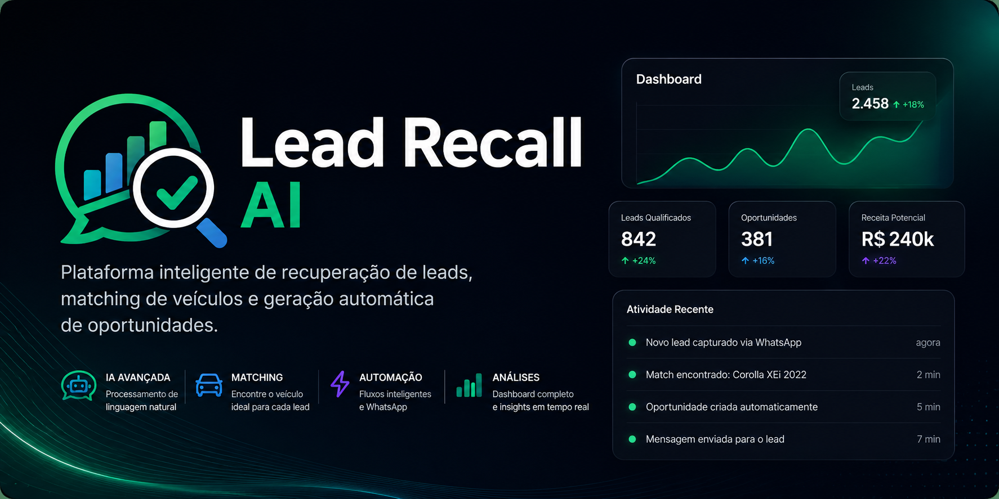

# 🚀 Lead Recall AI

<p align="center">
  
</p>

<p align="center">
  <b>Sistema inteligente de recuperação de leads e geração automática de oportunidades</b><br/>
  para concessionárias e negócios baseados em estoque.
</p>

---

## 💡 O que o sistema faz

O **Lead Recall AI** transforma conversas de clientes em oportunidades reais de venda utilizando IA, processamento de eventos e um motor de matching entre leads e veículos.

Ele analisa mensagens recebidas (ex: WhatsApp), extrai intenção de compra e mantém os leads vivos no sistema.

---

### 🔄 Fluxo automático

Quando novos veículos entram no estoque, o sistema:

- 🧠 Identifica leads com interesse compatível  
- 🔍 Executa o motor de matching inteligente  
- 🚗 Cria oportunidades automaticamente  
- 📊 Calcula score do lead e da oportunidade  
- 🤖 Aciona fluxo de automação comercial  

---

## ⚙️ Funcionalidades principais

- 🧠 Detecção de intenção de compra com IA  
- 🎯 Sistema de qualificação e score de leads  
- 📦 Monitoramento de estoque em tempo real  
- 🔗 Motor de matching lead × veículo  
- 📈 Geração automática de oportunidades  
- 💬 Integração com WhatsApp (Evolution API / Meta API ready)  
- 🔄 Integração com CRM e ERP  
- ⚡ Arquitetura orientada a eventos  
- 🌐 Suporte multi-canal  

---

## 🧪 Exemplo: IA em ação

### 📩 Mensagem recebida

```txt
"Quero um Corolla usado até 80 mil"
```

### 🧠 Extração via IA
```json
{
  "intent": "BUY_CAR",
  "vehicle": "Toyota Corolla",
  "budget": 80000,
  "confidence": 0.90
}
```

### 📊 Lead criado no sistema
```json
{
  "phone": "5511999999999",
  "intent": "BUY_CAR",
  "vehicleInterest": "Toyota Corolla",
  "budget": 80000,
  "confidence": 0.90,
  "score": 80
}
```

## 🚗 Exemplo: Motor de matching

### 🆕 Veículo cadastrado
Toyota Corolla XEi 2022 - R$ 79.900

### 🔍 Resultado do sistema
Match encontrado:

- Lead: 5511999999999
- Interesse: Toyota Corolla
- Compatibilidade de orçamento: SIM
- Score do lead: 80

## 🏗️ Arquitetura do sistema

O Lead Recall AI é baseado em uma arquitetura orientada a eventos, projetada para escalabilidade e processamento em tempo real.

### 🔌 Componentes principais
- 📩 Entrada de mensagens
- Recebe mensagens de WhatsApp, Instagram e Web Chat
- 🔌 Camada de adaptação
- Normaliza diferentes formatos em eventos únicos
- ⚙️ EventBus (núcleo do sistema)
- Orquestra todos os eventos internos
- 🧠 Motor de IA
- Extrai intenção, orçamento e confiança
- 🚗 Motor de estoque
- Gerencia veículos disponíveis
- 🔍 Motor de matching
- Conecta leads com veículos compatíveis
- 🤖 Camada de automação
- Cria oportunidades e executa ações
- 📊 Módulo de análise
- Métricas de performance e conversão

## 🎯 Objetivo

Transformar conversas de clientes em oportunidades reais de venda, automaticamente e em tempo real.

## ⚡ Visão

<p align="center"> <b>“Nenhum lead deveria ser perdido por falta de memória do sistema.”</b> </p>

## 🧠 Stack tecnológica
- Java 21
- Spring Boot
- Spring Data JPA
- MySQL
- Arquitetura orientada a eventos
- Integração com IA (OpenAI / Groq compatible)

### 🔥 Por que isso importa

A maioria das vendas perdidas não acontece porque o cliente disse “não”…

mas porque ninguém lembrou dele depois.

## 💡 O Lead Recall AI resolve isso:
- 👉 Ele lembra
- 👉 Ele entende
- 👉 Ele reconecta
- 👉 Ele vende
- 📌 Próximos passos (evolução)
- 🔎 Matching fuzzy (Levenshtein / NLP)
- 🧠 Embeddings para matching semântico
- 📊 Score avançado de oportunidades
- ⚡ Processamento assíncrono (Kafka/RabbitMQ)
- 📈 Dashboard comercial completo
- 🔁 Reativação automática de leads antigos